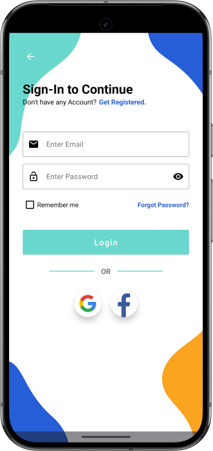
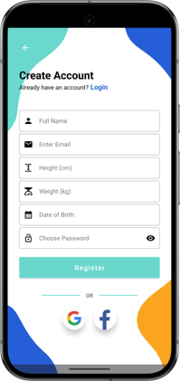
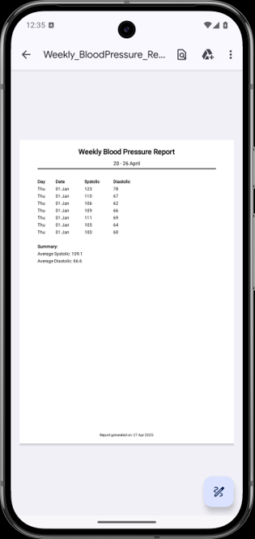
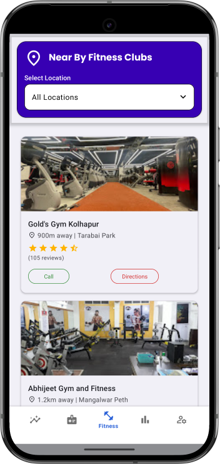
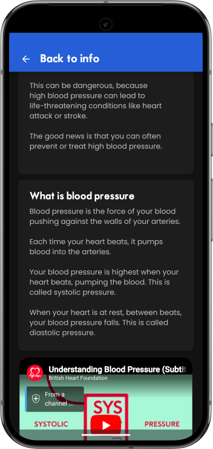

# 🩺 VitaFit

VitaFit is an Android health monitoring application designed to help users track their daily health and fitness activities in one place. The app provides an intuitive interface for recording health metrics, viewing progress, and maintaining a healthier lifestyle.

## ✨ Features

* 💧 Water intake tracking
* 🔥 Calorie tracking
* 🩸 Blood sugar monitoring
* ❤️ Blood pressure monitoring
* 👣 Daily step count tracking
* 📊 Weekly and monthly health reports
* 📈 Interactive charts and analytics
* 👤 User profile management
* 🤖 AI-powered health assistant
* 💾 Local data storage using SQLite

## 🛠️ Tech Stack

* **Language:** Java
* **IDE:** Android Studio
* **Database:** SQLite
* **UI:** XML
* **Charts:** MPAndroidChart

## 📱 Screenshots

  
  
  

  
  
  

  
  
  

## 🚀 Getting Started

1. Clone the repository.
2. Open the project in Android Studio.
3. Sync Gradle dependencies.
4. Build and run the application on an Android device or emulator.

## 📌 Future Enhancements

* Cloud data backup
* Firebase authentication
* Health reminders and notifications
* Dark mode support
* Wear OS integration
* Enhanced AI health insights

## 🤝 Contributing

Contributions, suggestions, and feedback are welcome. Feel free to open an issue or submit a pull request.

## 📄 License

This project is intended for educational and learning purposes.

---

⭐ If you found this project useful, consider giving it a star!
