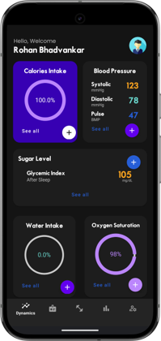
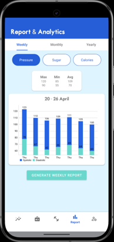
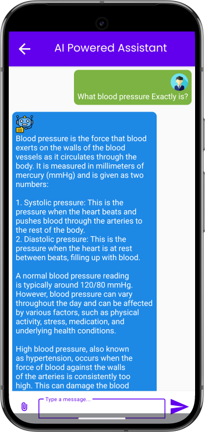
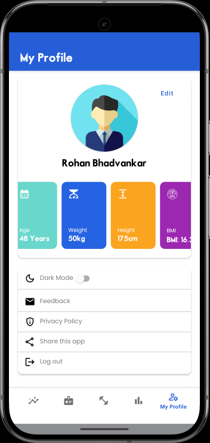

# VitaFit

VitaFit is a comprehensive Android health and fitness monitoring application designed to record daily health metrics, analyze progress, and encourage a healthier lifestyle through intuitive tracking tools and an AI-powered assistant.

## Features

- **Water & Calorie Tracking:** Monitor daily hydration and daily caloric intake.
- **Vitals Monitoring:** Track blood sugar levels, blood pressure readings, and daily step counts.
- **Analytics & Reports:** Generate comprehensive weekly/monthly reports with interactive data visualization.
- **AI Assistant:** Instant health insights and context-aware query responses.
- **Local Persistence:** Structured data storage using SQLite.

## Tech Stack

- **Language:** Java
- **IDE:** Android Studio
- **Database:** SQLite
- **UI Architecture:** XML Layouts
- **Data Visualization:** MPAndroidChart

## Screenshots

| Dashboard | Reports & Analytics | AI Assistant | Profile |
| :---: | :---: | :---: | :---: |
|  |  |  |  |

## Getting Started

### Prerequisites
- Android Studio Jellyfish / Ladybug or newer
- JDK 17+
- Android SDK 24+ (Android 7.0 Nougat minimum)

### Setup & Installation
1. Clone the repository:
   ```bash
   git clone https://github.com/Rohu06/VitaFit.git
   ```
2. Open the project directory in **Android Studio**.
3. Allow Gradle to sync dependencies automatically.
4. Run the project on an Android Emulator or connected physical device.

## Future Enhancements

- Cloud synchronization and backup
- Firebase authentication integration
- Custom health reminders and push notifications
- Dark mode toggle support
- Wear OS device integration

## Contributing

Contributions, suggestions, and feature requests are welcome. Feel free to open an issue or submit a pull request.

## License

Distributed for educational and demonstration purposes.

---

⭐ *If you find this project helpful, consider starring the repository!*
